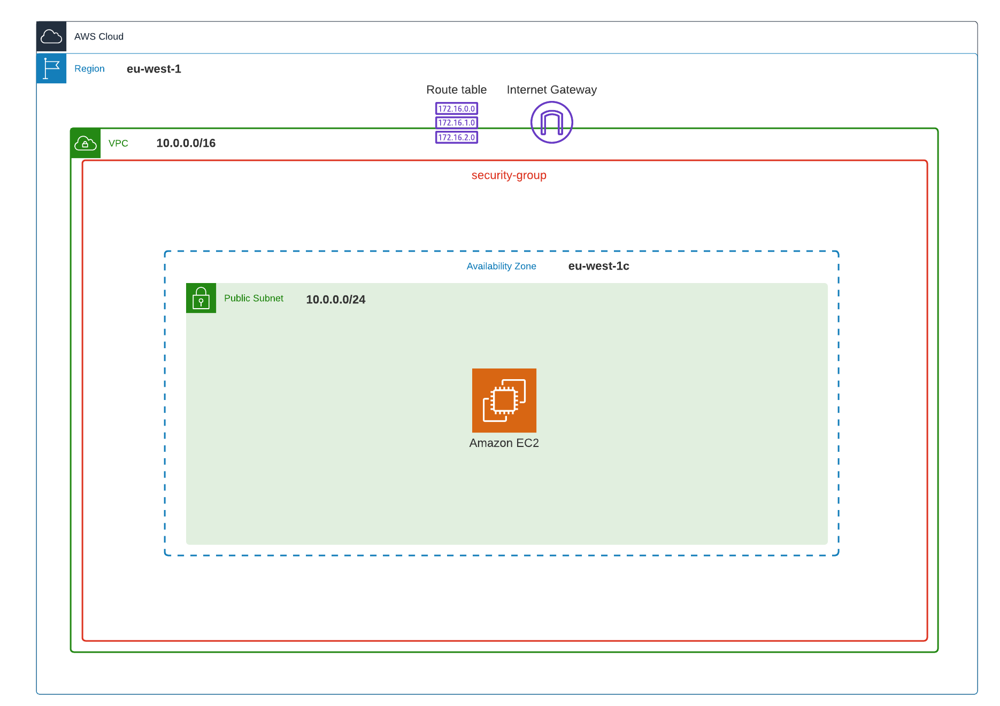

# terraform-full-ec2

### Provision an EC2 instance and all its associated resources 🧰✅
1. a VPC, default gateway, an entry in the routing table and a security group
1. a subnet and a NIC
1. the instance
1. a DNS record pointing to the instance



## 👷‍♂️ Launch
```powershell
terraform apply -auto-approve `
    -var "key_name=my_key"
    -var "zone_id=my_zone_id" `
    -var 'domain=test.gforien.com' `
```
